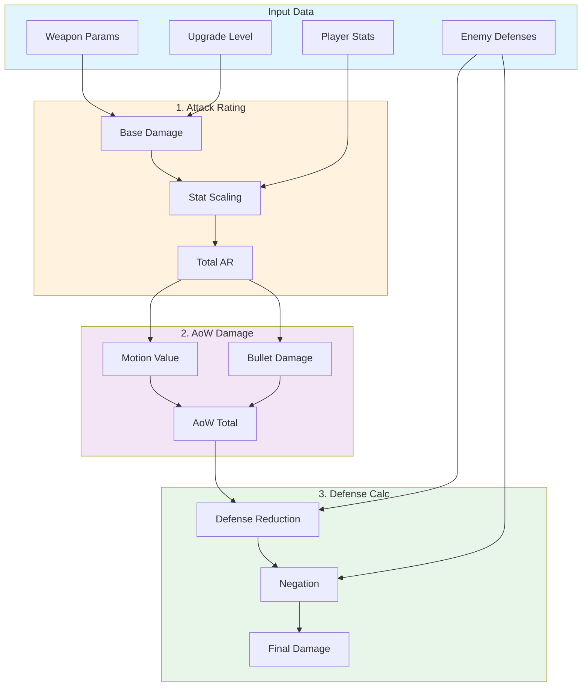
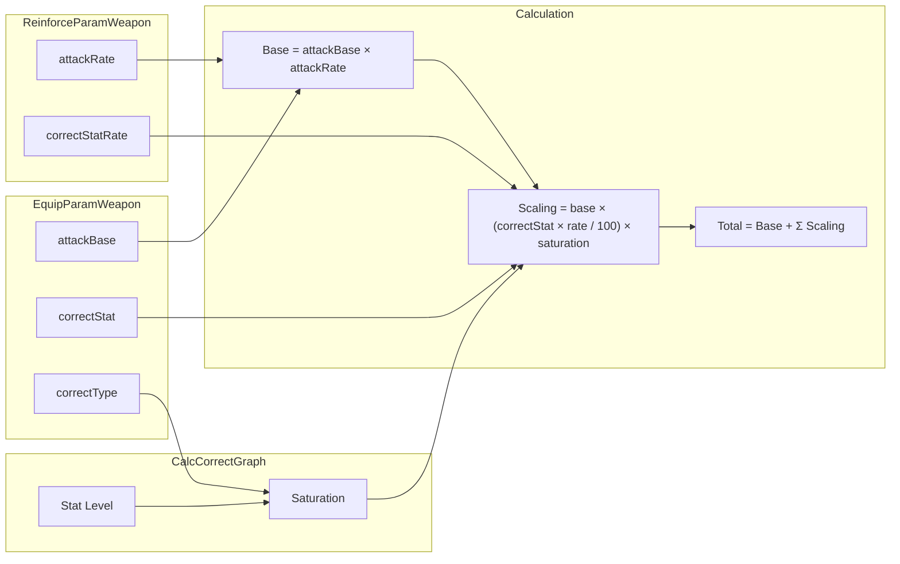
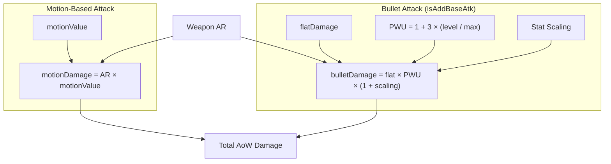
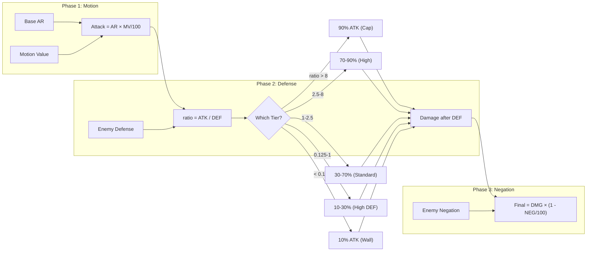

# Elden Ring Damage Mechanics

This document details how weapon damage, Ash of War (AoW) damage, and damage against enemy defenses are calculated in this calculator. Field names reference their original names from the game's `.param` files.

---

## Overview Flow



---

## Table of Contents

1. [Weapon Attack Rating (AR) Calculation](#1-weapon-attack-rating-ar-calculation)
2. [Ash of War (AoW) Damage Calculation](#2-ash-of-war-aow-damage-calculation)
3. [Enemy Defense Calculation](#3-enemy-defense-calculation)
4. [Param File Field Reference](#4-param-file-field-reference)
5. [Status Effect Calculation](#5-status-effect-calculation)
6. [Spell Scaling (Catalysts)](#6-spell-scaling-catalysts)

---

## 1. Weapon Attack Rating (AR) Calculation

Attack Rating is calculated per damage type (Physical, Magic, Fire, Lightning, Holy) and then summed.



### 1.1 Base Damage

Base damage is the weapon's innate damage before stat scaling is applied.

```
finalBase = attackBase × attackRate
```

| Component | Param Field | Description |
|-----------|-------------|-------------|
| `attackBase` | `attackBasePhysics`, `attackBaseMagic`, `attackBaseFire`, `attackBaseThunder`, `attackBaseDark` | Base attack value from `EquipParamWeapon` |
| `attackRate` | `physicsAtkRate`, `magicAtkRate`, `fireAtkRate`, `thunderAtkRate`, `darkAtkRate` | Upgrade multiplier from `ReinforceParamWeapon` |

> **Note:** In-game, "Thunder" = Lightning and "Dark" = Holy.

### 1.2 Stat Scaling

Stat scaling adds damage based on player attributes and the weapon's scaling values.

#### Per-Stat Contribution Formula

```
statContribution = base × (scalingValue / 100) × saturation
```

Where:
- `base` = finalBase (from step 1.1)
- `scalingValue` = `correctStat × correctStatRate` (e.g., `correctStrength × correctStrengthRate`)
- `saturation` = Value from `CalcCorrectGraph` curve at the player's stat level (0-1+ range)

#### Scaling Value Components

| Component | Param Field (EquipParamWeapon) | Param Field (ReinforceParamWeapon) |
|-----------|-------------------------------|-----------------------------------|
| Strength | `correctStrength` | `correctStrengthRate` |
| Dexterity | `correctAgility` | `correctAgilityRate` |
| Intelligence | `correctMagic` | `correctMagicRate` |
| Faith | `correctFaith` | `correctFaithRate` |
| Arcane | `correctLuck` | `correctLuckRate` |

### 1.3 Curve Calculation (Soft Caps)

The `CalcCorrectGraph` curves define diminishing returns at stat breakpoints. Each curve has 5 stages:

| Param Field | Description |
|-------------|-------------|
| `stageMaxVal0-4` | Stat level breakpoints |
| `stageMaxGrowVal0-4` | Growth values at each stage |
| `adjPt_maxGrowVal0-4` | Curve shape adjustment (positive = concave, negative = convex) |

**Algorithm:**
1. Find which segment the stat level falls into
2. Calculate progress through segment: `ratio = (stat - minStat) / (maxStat - minStat)`
3. Apply curve shape:
   - If `adjPt > 0`: `growthVal = ratio^adjPt`
   - If `adjPt < 0`: `growthVal = 1 - (1 - ratio)^|adjPt|`
4. Interpolate: `saturation = minGrowVal + (maxGrowVal - minGrowVal) × growthVal`
5. Return: `saturation / 100`

Curve IDs are specified per damage type in `EquipParamWeapon`:
- `correctType_Physics`, `correctType_Magic`, `correctType_Fire`, `correctType_Thunder`, `correctType_Dark`

### 1.4 Which Stats Affect Which Damage Types

The `AttackElementCorrectParam` table (referenced by `attackElementCorrectId`) determines stat-to-damage mappings:

| Boolean Field Pattern | Example |
|-----------------------|---------|
| `is{Stat}Correct_by{DamageType}` | `isStrengthCorrect_byPhysics`, `isMagicCorrect_byFire` |

Override scaling values can replace weapon defaults:
- `overwrite{Stat}CorrectRate_by{DamageType}` (value of -1 means use weapon's default)

### 1.5 Two-Handing Bonus

Two-handing multiplies Strength by 1.5 (floored), capped at 148:

```
effectiveStrength = min(floor(strength × 1.5), 148)
```

**Exceptions:**
- Fist weapons (`wepType` = 35): No 2H bonus
- Paired weapons (`isDualBlade` = true): No 2H bonus
- Bows/Ballistae (`wepType` = 50, 51, 53, 56): Always 2H

### 1.6 Requirement Penalty

If stat requirements aren't met for a damage type:

```
scaling = base × -0.4
```

Requirements are from `EquipParamWeapon`:
- `properStrength`, `properAgility`, `properMagic`, `properFaith`, `properLuck`

### 1.7 Total AR Calculation

```
totalDamageType = base + Σ(statContributions)
totalAR = physical + magic + fire + lightning + holy
```

### 1.8 Scaling Letter Grades

| Raw Scaling Value | Grade |
|-------------------|-------|
| 0 | - |
| 1-24 | E |
| 25-59 | D |
| 60-89 | C |
| 90-139 | B |
| 140-174 | A |
| 175+ | S |

---

## 2. Ash of War (AoW) Damage Calculation

AoW attacks have two damage sources: **motion-based** and **bullet-based**.



### 2.1 Motion-Based Attacks

Motion attacks multiply weapon AR by a motion value:

```
motionDamage = weaponAR × motionValue
```

| Component | Source |
|-----------|--------|
| `weaponAR` | Total damage for this type from Section 1 |
| `motionValue` | From `AtkParam_Pc` (e.g., 0.5 = 50% of AR, 1.5 = 150%) |

Motion values per damage type: `motionPhys`, `motionMag`, `motionFire`, `motionThun`, `motionDark`

### 2.2 Bullet/Spell Attacks (isAddBaseAtk = true)

Bullet attacks use flat damage that scales with upgrade level and stats:

```
bulletDamage = flatDamage × pwuMultiplier × (1 + totalScaling)
```

#### PWU (Percent Weapon Upgrade) Multiplier

```
pwuMultiplier = 1 + 3 × (upgradeLevel / maxUpgradeLevel)
```

- At +0: 1.0
- At max level: 4.0

#### Stat Scaling for Bullets

```
totalScaling = Σ(scalingPercent / 100 × saturation)
```

Scaling sources (in priority order):
1. `overwrite{Stat}CorrectRate_by{DamageType}` from `AttackElementCorrectParam` at `overwriteAttackElementCorrectId`
2. Weapon's own scaling (if `overwriteAttackElementCorrectId` = -1)

Flat damage values from attack params: `flatPhys`, `flatMag`, `flatFire`, `flatThun`, `flatDark`

### 2.3 Stat Point Bonuses

Some AoWs (War Cry, Barbaric Roar, Shriek of Milos) grant temporary stat bonuses:

```
bonusAR = base × saturation × (bonusPoints / 100)
```

The effective AR for motion damage becomes:
```
effectiveAR = weaponAR + bonusAR
```

### 2.4 Stamina Damage

```
staminaDamage = attackBaseStamina × staminaAtkRate × motionStam + flatStam
```

| Field | Source |
|-------|--------|
| `attackBaseStamina` | `EquipParamWeapon` |
| `staminaAtkRate` | `ReinforceParamWeapon` |
| `motionStam`, `flatStam` | Attack params |

### 2.5 Poise Damage

```
poiseDamage = saWeaponDamage × 1.0 × motionPoise + flatPoise
```

| Field | Source |
|-------|--------|
| `saWeaponDamage` | `EquipParamWeapon` (Super Armor weapon damage) |
| `motionPoise`, `flatPoise` | Attack params |

### 2.6 Shield Chip

```
shieldChip = 1 - (1 + guardCutCancelRate / 100)
```

A positive `guardCutCancelRate` reduces chip damage.

### 2.7 Attack Attribute Resolution

The `atkAttribute` field determines physical damage subtype:

| Value | Type |
|-------|------|
| 0 | Standard |
| 1 | Strike |
| 2 | Slash |
| 3 | Pierce |
| 252 | Use weapon's secondary (`atkAttribute2`) |
| 253 | Use weapon's primary (`atkAttribute`) |

---

## 3. Enemy Defense Calculation

Damage against enemies uses a 3-phase system.



### 3.1 Phase 1: Motion Value Application

```
totalAttack = baseAR × (motionValue / 100)
```

For weapon table comparisons, motion value = 100 (representing a 1:1 AR-to-attack ratio).

### 3.2 Phase 2: Defense Reduction (Step Function)

A piecewise quadratic function based on ATK/DEF ratio with 5 tiers:

```
ratio = attack / defense
```

| Tier | Condition | Formula | Damage Range |
|------|-----------|---------|--------------|
| 5 (Cap) | DEF < 0.125 × ATK | `0.90 × ATK` | 90% |
| 4 (High) | DEF ≤ 0.4 × ATK | `((-0.8/121) × (ratio - 8)² + 0.9) × ATK` | 70-90% |
| 3 (Standard) | DEF ≤ ATK | `((-0.4/3) × (ratio - 2.5)² + 0.7) × ATK` | 30-70% |
| 2 (High DEF) | DEF ≤ 8 × ATK | `((19.2/49) × (ratio - 0.125)² + 0.1) × ATK` | 10-30% |
| 1 (Wall) | DEF > 8 × ATK | `0.10 × ATK` | 10% |

### 3.3 Phase 3: Negation Application

```
finalDamage = damageAfterDefense × (1 - negation / 100)
```

Negation is a percentage reduction (can be negative for vulnerability).

### 3.4 Physical Defense Type Selection

Physical damage uses the attack's attribute to select which defense to use:

| Attack Attribute | Defense Used |
|------------------|--------------|
| Standard | `defense.physical`, `negation.physical` |
| Strike | `defense.strike`, `negation.strike` |
| Slash | `defense.slash`, `negation.slash` |
| Pierce | `defense.pierce`, `negation.pierce` |

Elemental damage (Magic, Fire, Lightning, Holy) uses their respective defense/negation values directly.

---

## 4. Param File Field Reference

### 4.1 EquipParamWeapon (Weapon Definition)

| Field | Description |
|-------|-------------|
| **Base Damage** | |
| `attackBasePhysics` | Base physical damage |
| `attackBaseMagic` | Base magic damage |
| `attackBaseFire` | Base fire damage |
| `attackBaseThunder` | Base lightning damage |
| `attackBaseDark` | Base holy damage |
| `attackBaseStamina` | Base stamina damage |
| `saWeaponDamage` | Base poise damage |
| **Scaling** | |
| `correctStrength` | Strength scaling value (0-255) |
| `correctAgility` | Dexterity scaling value |
| `correctMagic` | Intelligence scaling value |
| `correctFaith` | Faith scaling value |
| `correctLuck` | Arcane scaling value |
| **Curve IDs** | |
| `correctType_Physics` | CalcCorrectGraph ID for physical |
| `correctType_Magic` | CalcCorrectGraph ID for magic |
| `correctType_Fire` | CalcCorrectGraph ID for fire |
| `correctType_Thunder` | CalcCorrectGraph ID for lightning |
| `correctType_Dark` | CalcCorrectGraph ID for holy |
| `correctType_Poison/Blood/Sleep/Madness` | Status effect curve IDs |
| **References** | |
| `attackElementCorrectId` | References `AttackElementCorrectParam` |
| `reinforceTypeId` | References `ReinforceParamWeapon` |
| `spEffectBehaviorId0/1` | References `SpEffectParam` for status effects |
| `swordArtsParamId` | References `SwordArtsParam` for weapon skill |
| **Requirements** | |
| `properStrength/Agility/Magic/Faith/Luck` | Stat requirements |
| **Properties** | |
| `wepType` | Weapon class ID |
| `isDualBlade` | Paired weapon flag |
| `atkAttribute` | Primary physical type (0=Standard, 1=Strike, 2=Slash, 3=Pierce) |
| `atkAttribute2` | Secondary physical type |
| `gemMountType` | 0/1=Unique, 2=Can mount AoWs |
| `throwAtkRate` | Critical modifier (0=100, 30=130 crit) |
| `weight` | Weapon weight |

### 4.2 ReinforceParamWeapon (Upgrade Rates)

| Field | Description |
|-------|-------------|
| **Attack Rates** | |
| `physicsAtkRate` | Physical damage multiplier at this level |
| `magicAtkRate` | Magic damage multiplier |
| `fireAtkRate` | Fire damage multiplier |
| `thunderAtkRate` | Lightning damage multiplier |
| `darkAtkRate` | Holy damage multiplier |
| `staminaAtkRate` | Stamina damage multiplier |
| **Scaling Rates** | |
| `correctStrengthRate` | Strength scaling multiplier |
| `correctAgilityRate` | Dexterity scaling multiplier |
| `correctMagicRate` | Intelligence scaling multiplier |
| `correctFaithRate` | Faith scaling multiplier |
| `correctLuckRate` | Arcane scaling multiplier |
| **Status Effect Offsets** | |
| `spEffectId1` | Offset for `spEffectBehaviorId0` |
| `spEffectId2` | Offset for `spEffectBehaviorId1` |
| **Metadata** | |
| `maxReinforceLevel` | Max upgrade level (10 or 25) |

### 4.3 CalcCorrectGraph (Soft Cap Curves)

| Field | Description |
|-------|-------------|
| `stageMaxVal0-4` | Stat breakpoints for each stage |
| `stageMaxGrowVal0-4` | Growth percentage at each stage |
| `adjPt_maxGrowVal0-4` | Curve shape exponent |

### 4.4 AttackElementCorrectParam (Stat-to-Damage Mapping)

| Field Pattern | Description |
|---------------|-------------|
| `is{Stat}Correct_by{Type}` | Boolean: does stat affect damage type? |
| `overwrite{Stat}CorrectRate_by{Type}` | Override scaling (-1 = use weapon default) |

Where:
- `{Stat}` = Strength, Dexterity, Magic, Faith, Luck
- `{Type}` = Physics, Magic, Fire, Thunder, Dark

### 4.5 SpEffectParam (Status Effect Values)

| Field | Description |
|-------|-------------|
| `poizonAttackPower` | Poison buildup value |
| `diseaseAttackPower` | Scarlet Rot buildup value |
| `bloodAttackPower` | Bleed buildup value |
| `freezeAttackPower` | Frost buildup value |
| `sleepAttackPower` | Sleep buildup value |
| `madnessAttackPower` | Madness buildup value |

---

## 5. Status Effect Calculation

Status effects (poison, bleed, frost, etc.) use a simpler formula:

```
base = SpEffectParam value at (spEffectBehaviorId + spEffectIdOffset)
scaling = base × (arcaneScaling / 100) × arcaneSaturation
total = base + scaling
```

If arcane requirement is not met:
```
total = (base + scaling) × 0.6
```

Only Arcane affects status effect scaling, using the `correctLuck` value and `correctType_Poison/Blood/Sleep/Madness` curves.

---

## 6. Spell Scaling (Catalysts)

Staffs and Seals use spell scaling instead of damage:

```
spellScaling = 100 × (1 + Σ(scalingRatio × saturation))
```

Where:
- Base is always 100
- `scalingRatio = scalingValue / 100`
- Saturation comes from the catalyst's curves

If requirements aren't met:
```
spellScaling = 60
```

Catalyst flags in `EquipParamWeapon`:
- `enableMagic`: Can cast sorceries (staffs)
- `enableMiracle`: Can cast incantations (seals)
